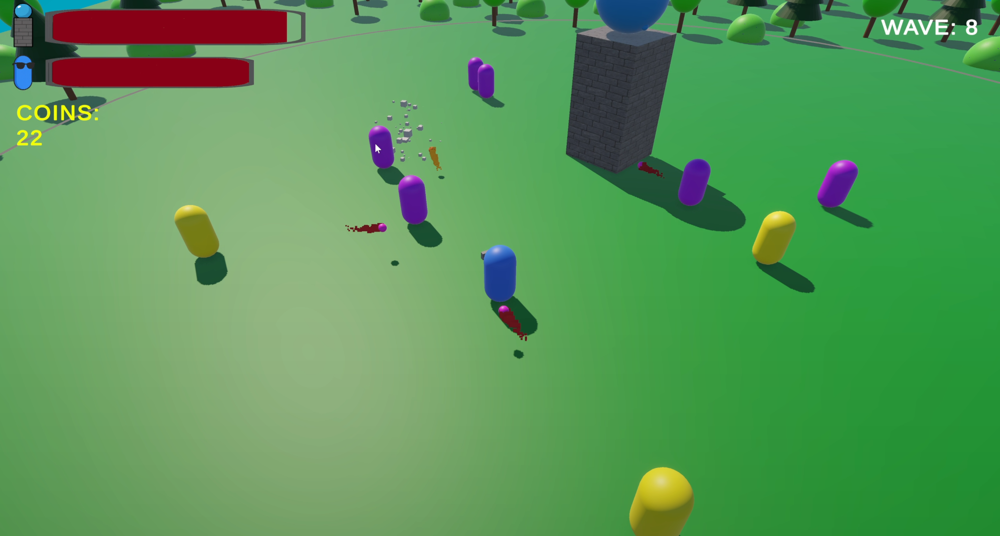
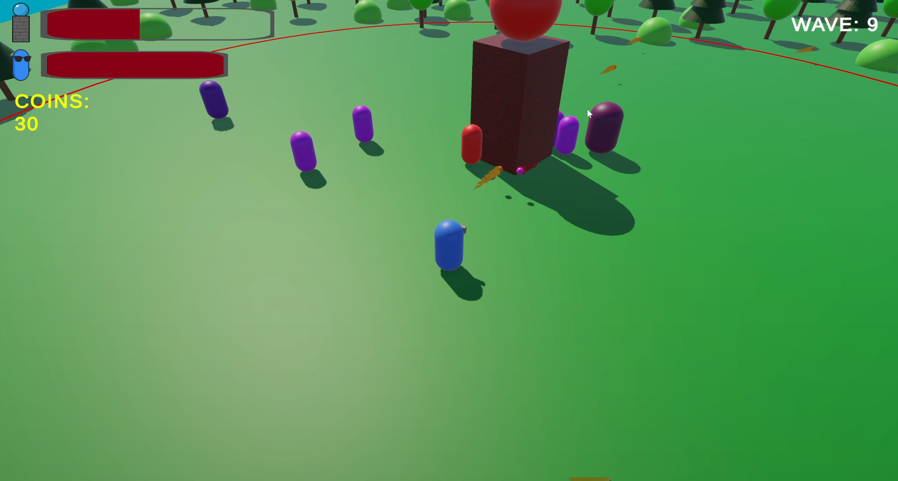

# bean-smasher
A wave-based defense game where you protect a central tower from relentless enemy attacks. You control the player, fight off enemies, buy upgrades and survive as waves become progressively harder.

## Preview
### DEMO
https://youtu.be/FfkJxhAbAM0
### Screenshots

#### Main Menu

#### Between Waves

#### Combat

#### Combat 2

## Features
Wave System – Scaling difficulty and randomized enemy composition.

Player Combat – Smooth movement, aiming with mouse, and shooting mechanics.

Tower Defense – Keep the central tower alive while managing threats.

Multiple Enemy Types – Ranged, melee, tanks, and more with unique behavior.

Health Systems – Regenerating player and tower health with on-screen health bars.

UI and Menus – Main menu, pause, and game-over screens with polished transitions.

## Code Highlights

Scene-Specific Managers – Each scene has its own GameManager, keeping responsibilities self-contained and making testing easier.

Entity-Component Design – All player, enemy, and tower classes inherit from a common Entity base, handling shared functionality like health, death, and damage.

Scriptable Objects for Data – Key stats (health, damage, speed, etc.) are stored in ScriptableObjects, allowing easy tuning and reuse across multiple entities.

AI Pathfinding with NavMeshAgents – Enemy units navigate the map using Unity’s built-in NavMeshAgent system for dynamic pathfinding and obstacle avoidance.

Polished Particle Effects – Projectiles, hits, and enemy deaths are enhanced with particle effects to improve visual feedback.

Frame-Independent Movement – Physics-based movement uses Time.deltaTime (or Time.fixedDeltaTime where appropriate) for consistent gameplay across refresh rates.

UI/UX Integration – Dynamic UI updates (health bars, wave counters, menus) are tied cleanly to game state without hidden inspector dependencies.

## How to Play
1. Clone this repository.

2. Open in Unity (6.0+).

3. Run the Main Menu scene and hit Play.

4. Defend the tower, survive as many waves as you can, and don’t let the enemies destroy your base!
